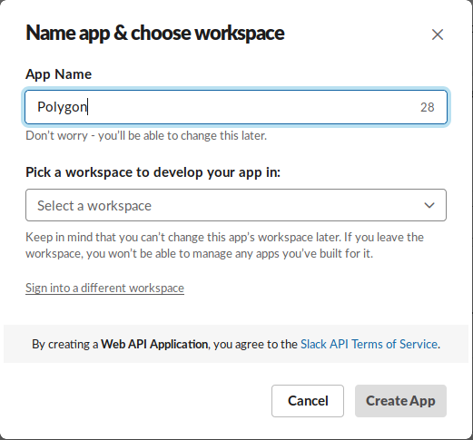
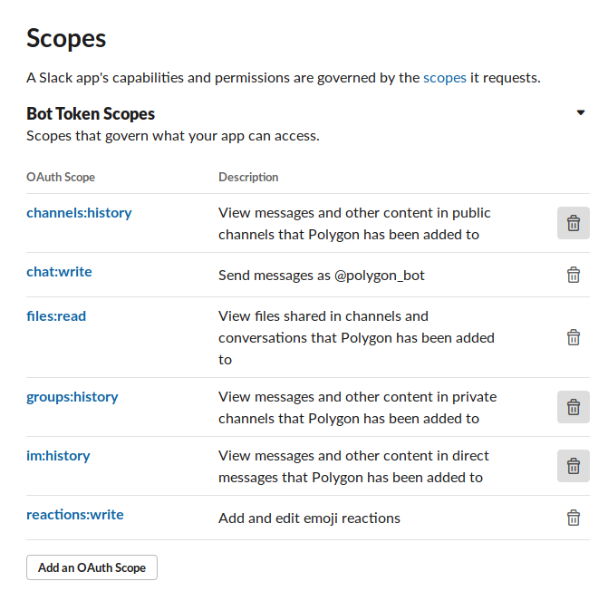

# Polygon Slack Integration

## Description

We present a simple example of using the [pythf](https://github.com/Group-IB/pythf) library for integrating the capabilities of the THF Polygon into a Slack.

PolygonBot is a flask-application which listens for Slack events from channels which it was invited to. If there is a file in a message bot sends it to Polygon and waits for the result. If the file is benign bot will react with an 'angel' sticker. And if the file is malicious bot will react with an 'smiling_imp' sticker and will give short description in a thread.

## Installation guide

### Create a Slack application

You can do this by clicking [here](https://api.slack.com/apps?new_app=1)



Pick a name and choose a workspace to install your app to.

#### Set up the events subscription

You need to subscribe Bot to your Slack events.
```
Request URL: "https://<bot-application-url>/listening"
```

#### Set up the scopes for the Bot Token



### Deploy PolygonBot python application

1. Generate THF Huntbox Token from the web interface.
2. Install application requirements.
3. Set up conf.json.
4. Run the application.
